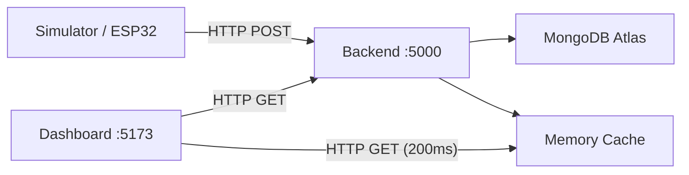

# Wind Turbine IoT Monitoring System

A real-time wind turbine monitoring and analysis system built for a university mechanical engineering project.

## What It Does

This system collects measurements from a wind turbine (wind speed, voltage, current, blade pitch angle), stores them in a cloud database, and displays them on a live dashboard.

```
ESP32 / Simulator  →  Backend (Node.js)  →  MongoDB Atlas
                                           ↕
                                    React Dashboard
```

## Architecture



## Features

- **Live monitoring** — Dashboard updates 5 times per second
- **6 metric cards** — Wind speed, pitch angle, voltage, current, power, stepper position
- **Live trend chart** — Rolling time-series with metric selector
- **3 experiments** — EXP-001 (0°), EXP-002 (4°), EXP-003 (20°) pitch angles
- **Summary statistics** — Average, min, max across all measurements
- **Power analysis** — Power vs Wind Speed and Power vs Pitch Angle charts
- **Historical data** — Paginated table of all past measurements
- **Live simulator** — Generates realistic simulated telemetry for demonstrations

## Quick Start

### Prerequisites
- Node.js v18+
- MongoDB Atlas account (free tier)

### 1. Install dependencies
```bash
cd backend && npm install
cd ../frontend && npm install
```

### 2. Configure environment
Create `backend/.env`:
```env
PORT=5000
MONGO_URI=mongodb+srv://<user>:<pass>@<cluster>.mongodb.net/windturbine?retryWrites=true&w=majority
```

### 3. Seed data (optional)
```bash
cd backend
npm run seed
```

### 4. Run (3 terminals)

| Terminal | Command | Purpose |
|---|---|---|
| 1 | `cd backend && npm start` | Backend server |
| 2 | `cd frontend && npm run dev` | Dashboard |
| 3 | `cd backend && npm run simulate` | Live simulator |

### 5. Open dashboard
Navigate to `http://localhost:5173/`

## Current Status

| Component | Status |
|---|---|
| Backend + MongoDB Atlas | ✅ Complete |
| React Dashboard | ✅ Complete |
| Live Simulator | ✅ Complete |
| ESP32 Hardware | ⏳ Not yet connected |

The system is fully functional with simulated data. The ESP32 will replace the simulator using the same HTTP API — no software changes needed.

## Documentation

Full documentation is in [`docs/`](./docs/):

| Folder | Contents |
|---|---|
| `01_Overview` | Project overview, purpose, glossary |
| `02_System_Architecture` | Architecture, flows, diagrams |
| `03_How_The_System_Works` | ESP32, backend, database, frontend, live updates |
| `04_Wind_Turbine_Data` | Measurements, experiments, power calculation, simulator |
| `05_Dashboard` | Dashboard guide, live monitoring, analytics, history |
| `06_Setup_And_Running` | Requirements, installation, running, troubleshooting |
| `07_Data_Communication` | ESP32↔Backend, Backend↔DB, Backend↔Frontend |
| `08_Technical_Reference` | API reference, project structure, configuration |
| `09_Demo_Guide` | University demo steps, simulator demo, hardware demo |

## Technology Stack

| Component | Technology |
|---|---|
| Backend | Node.js, Express, Mongoose |
| Database | MongoDB Atlas |
| Frontend | React, Vite, Recharts |
| Communication | HTTP (polling at 200ms) |
