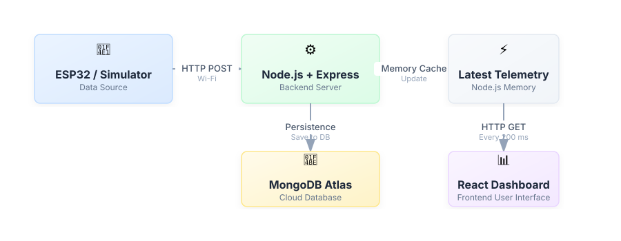

# System Architecture

## Overview

The system has three main parts that work together:

┌─────────────────────┐     ┌─────────────────────┐     ┌─────────────────────┐
│   Data Source        │     │   Backend Server     │     │   Dashboard          │
│                     │     │                     │     │                     │
│  ESP32 or Simulator │────▶│  Node.js + Express   │◀────│  React (browser)     │
│                     │     │       Port 5000      │     │      Port 5173       │
└─────────────────────┘     └──────────┬──────────┘     └─────────────────────┘
                                       │
                                       ▼
                            ┌─────────────────────┐
                            │   MongoDB Atlas      │
                            │   (cloud database)   │
                            └─────────────────────┘

  

## The Three Parts

### 1. Data Source (Simulator or ESP32)

This is where measurements come from. Currently, a software **simulator** generates realistic measurement values. In the future, an **ESP32 microcontroller** will send real measurements from the actual wind turbine hardware.

Both the simulator and the ESP32 send data in exactly the same way — via HTTP POST requests to the backend. The backend doesn't need to know or care whether the data is simulated or real.

### 2. Backend Server (Node.js + Express)

The backend is the central hub of the system. It:

- **Receives measurements** from the simulator or ESP32
- **Validates** that the measurements are reasonable (e.g., wind speed is not negative)
- **Calculates power** from voltage and current (Power = Voltage × Current)
- **Stores** every measurement in MongoDB Atlas
- **Keeps the latest measurement in memory** for fast access
- **Serves data** to the dashboard when requested
- **Computes analytics** (averages, minimums, maximums, power curves)

### 3. Dashboard (React)

The dashboard is a web page that runs in your browser. It:

- **Polls the backend** every 200 milliseconds (5 times per second) for the latest measurement
- **Displays live values** — wind speed, voltage, current, power, pitch angle
- **Shows live charts** that update in real time
- **Loads historical data** and analytics from the backend
- **Does NOT connect to the database directly** — all data flows through the backend

## Key Design Decision: Why HTTP Polling?

The dashboard uses **HTTP polling** (repeatedly asking "any new data?") rather than WebSockets (a persistent two-way connection).

| Approach | Suitable For |
|---|---|
| HTTP Polling | Simple, easy to debug, perfect for localhost demonstration |
| WebSockets | High-frequency production systems with many users |

HTTP polling was chosen because:
- This is a **localhost university demonstration**, not a production application
- There is **only one dashboard user** viewing data
- HTTP is the **simplest** protocol to understand and debug
- The backend caches the latest value **in memory**, so no database query is needed per poll
- At 5 requests per second, the overhead is negligible on a local network

## Technology Stack

| Component | Technology | Purpose |
|---|---|---|
| Backend runtime | Node.js | JavaScript server runtime |
| Backend framework | Express | HTTP request routing |
| Database driver | Mongoose | MongoDB object modelling |
| Database | MongoDB Atlas | Cloud-hosted measurement storage |
| Frontend framework | React (via Vite) | Dashboard user interface |
| Charting | Recharts | Line charts, bar charts |
| Configuration | dotenv | Environment variables (.env file) |
