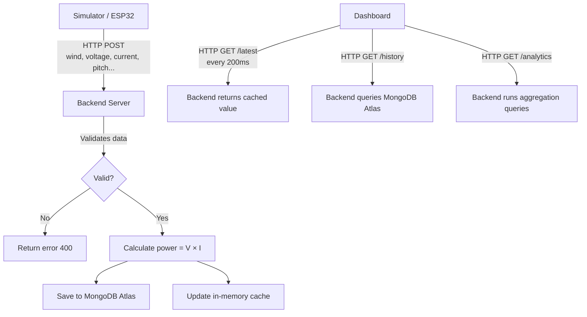

# Data Flow

## What Data Flows Through the System?

Every measurement (called a **telemetry record**) contains these values:

| Field | Example | Description |
|---|---|---|
| `experimentId` | `EXP-001` | Which experiment this measurement belongs to |
| `source` | `simulator` | Where the data came from (simulator or esp32) |
| `timestamp` | `2026-08-29T13:50:07Z` | When the measurement was taken |
| `windSpeed` | `4.52` | Wind speed in m/s |
| `pitchAngle` | `4` | Blade angle in degrees |
| `stepperPosition` | `200` | Motor position in steps |
| `voltage` | `8.20` | Generator voltage in Volts |
| `current` | `1.10` | Generator current in Amperes |
| `power` | `9.02` | Electrical power in Watts (calculated by backend) |

## Data Flow Diagram



## Important: Power Calculation

The data source (simulator or ESP32) sends:
- `voltage`
- `current`

The data source does **NOT** send `power`.

The backend **always** calculates:

```
power = voltage × current
```

This ensures that the power value is always consistent and cannot be manipulated by the sender.
