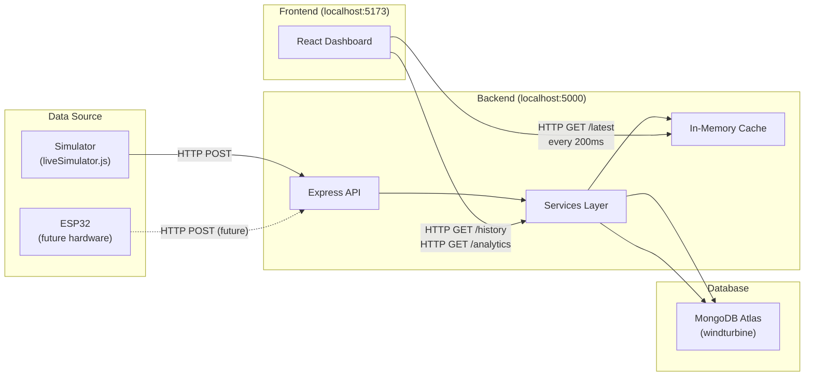
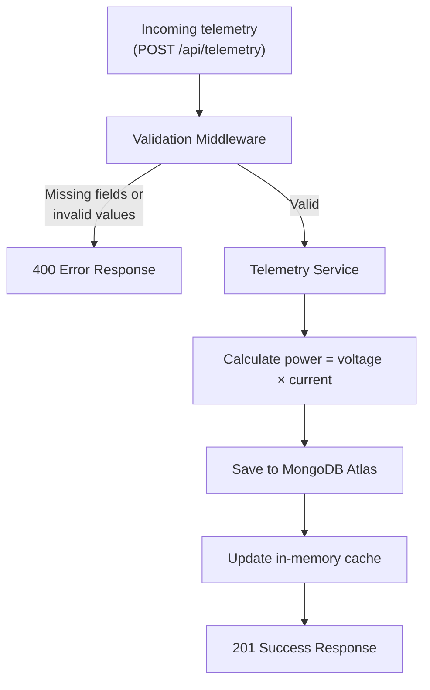
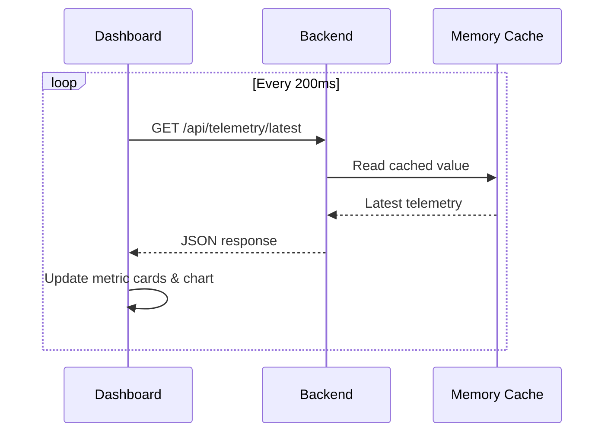
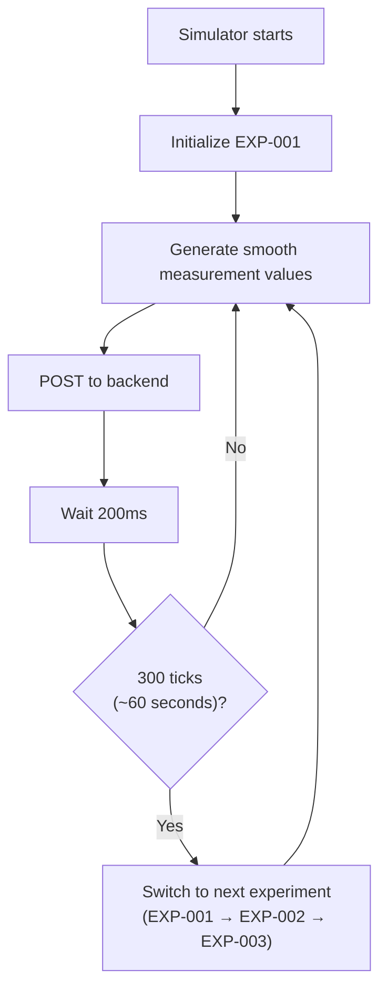
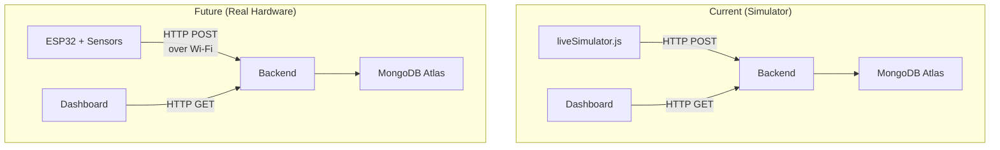

# Architecture Diagrams

## A. Overall Architecture

## B. Telemetry Processing Flow

## C. Dashboard Live-Update Flow

## D. Simulator Flow

## E. Current vs Future Architecture

The architecture is **identical** — the only difference is what sends the measurements.
