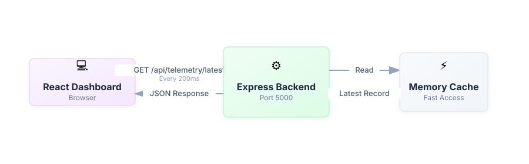
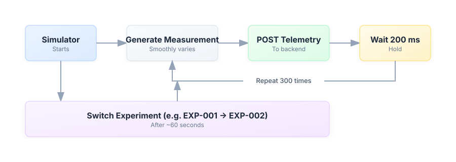
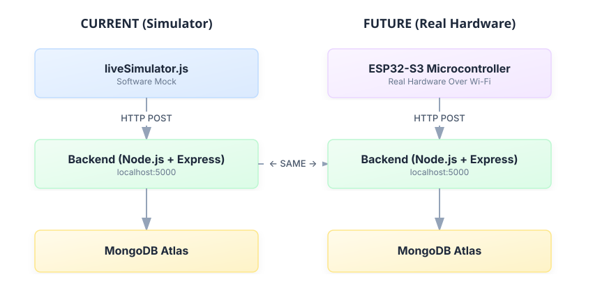

# Architecture Diagrams

## A. Overall Architecture

  

## B. Telemetry Processing Flow

  

## C. Dashboard Live-Update Flow

  

## D. Simulator Flow

  

## E. Current vs Future Architecture

  

The architecture is **identical** — the only difference is what sends the measurements.
